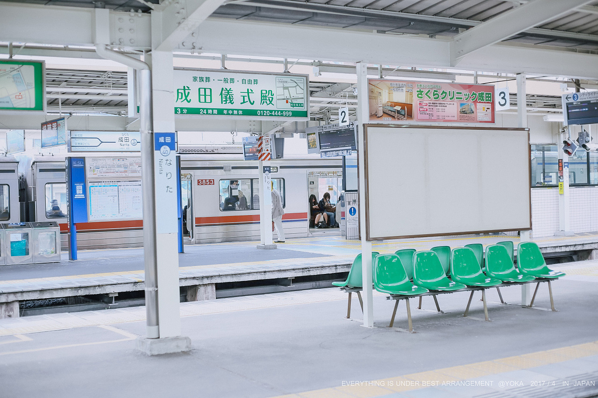
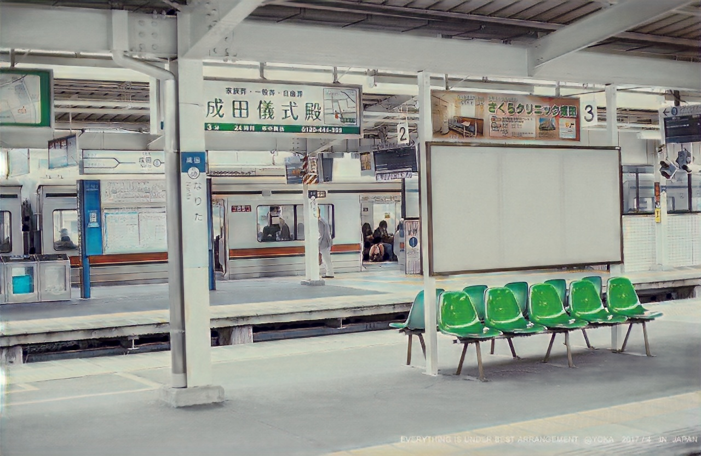
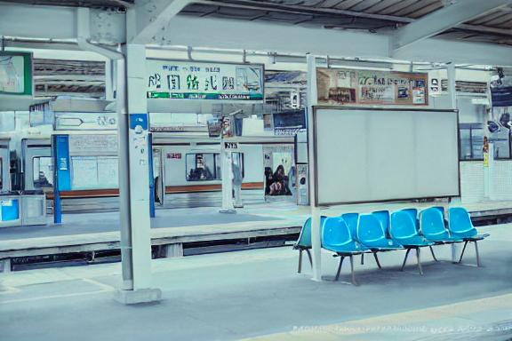

# Conditional GAN + Stable-Diffusion To Create Anime-Styled Images And Make Custom Animation Edits

## WORK INSPIRED FROM FOLLOWING PAPERS

```
1. AnimeGAN: A Novel Lightweight GAN for Photo Animation
2. InstructPix2Pix: Learning to Follow Image Editing Instructions
```

----------------------
## 1.SUMMARY

Training and Inference code for a model to convert input images into anime_style
Inference code to use Stable-Diffusion model to edit the anime_style image generated

-----------------------
## 2. DATA AND CHECKPOINTS

### 2.1 DOWNLOAD DATASET FOR TRAINING CGAN

```bash
wget -O anime-gan.zip https://github.com/ptran1203/pytorch-animeGAN/releases/download/v1.0/dataset_v1.zip
unzip anime-gan.zip
```

-----------------------
## 3. VSCODE DEBUGGER CONFIGS TO RUN TRAIN AND INFERENCE SCRIPTS

### 3.1 Train CGAN for converting images into anime style

```
{
    "name": "train",
    "type": "python",
    "request": "launch",
    "program": "${workspaceFolder}/train.py",
    "console": "integratedTerminal",
    "justMyCode": true,
    "args": [
        "--resume_cond", "gen_dis",
        "--dataset", "Hayao",
        "--use_spectral_norm",
        "--lr-discriminator", "0.00004",
        "--batch-size", "6",
        "--initial-epochs", "1",
        "--initial-lr", "0.0001",
        "--save-interval", "1",
        "--lr-generator", "0.00002",
        "--checkpoint-dir", "checkpoints",
        "--adversarial_loss_disc_weight", "10.0",
        "--save-image-dir", "save_imgs",          
        "--adversarial_loss_gen_weight", "10.0",              
        "--content_loss_weight", "1.5",              
        "--gram_loss_weight", "3.0",                
        "--chromatic_loss_weight", "30.0",                
    ]
}
```

### 2.2 Inference With CGAN
```
{
    "name": "inference",
    "type": "python",
    "request": "launch",
    "program": "${workspaceFolder}/inference.py",
    "console": "integratedTerminal",
    "justMyCode": true,
    "args": [
        "--checkpoint_path", "checkpoints/generator_Hayao.pth",
        "--source_file_path", "example/result/140.jpeg",
        "--destination_file_path", "save_imgs/inference_images/140_anime.jpg",
    ]
}
```

### 2.3 Edit Anime Styled Image With Stable-Diffusion
```
{
    "name": "stable_diffusion_edits",
    "type": "python",
    "request": "launch",
    "program": "${workspaceFolder}/stable_diffusion_inference.py",
    "console": "integratedTerminal",
    "justMyCode": true,
    "args": [
        "--source_file_path", "save_imgs/inference_images/140_anime.jpg",
        "--destination_file_path", "save_imgs/inference_images/140_anime_stable_diffused.jpg",
        "--edit_condition", "change the color of the bus to black"
    ]
}
```

-----------------------
## 3. RESULTS

### 3.1 INPUT IMAGE


### 3.2 ANIME STYLED IMAGE GENERATED


### 3.3 STABLE DIFFUSION EDITED IMAGE
```
CONDITIONAL QUERY - "turn green chairs into blue"
```


-----------------------
## 4. DIFFUSION MODEL TRAINING

### 4.1 CONCEPTS INVOLVED FROM CODE IMPLEMENTATION POV

The stable diffusion model involves 4 individual models which works as part of a diffusion pipeline:

__1.__ `Noise Scheduler:`

We have used `DDPMScheduler` as the scheduler for our diffusion process. This scheduler controls how much noise is added at each timestep controlled via:
`add_noise` function.

```
Example:
noise_scheduler = DDPMScheduler.from_pretrained(args.pretrained_model_name_or_path, subfolder="scheduler") # args.pretrained_model_name_or_path = "runwayml/stable-diffusion-v1-5"
noisy_latents = noise_scheduler.add_noise(latents, noise, timesteps) 
# noisy_latents.shape = torch.Size([4, 4, 32, 32]) # noise_scheduler = <DDPMScheduler, len() = 1000>
```

Work by Sohl-Dickstein et al., has shown that we can sample xt at any arbitrary timestep (noise level) conditioned based on x at 0th timestep (x0). 
Refer - `https://huggingface.co/blog/annotated-diffusion`

By taking advantage of this gaussian property, we can sample from a distribution which has noise levels at arbitrary timesteps, example, lets say that if total number of timesteps in the diffusion process is 1000, we can sample from distribution which mimicks the noise level at 0th, 29th, 39th, etc., or any arbitrary timestep for that matter and use it during training process.

For details about the pretrained model used, please refer:
`https://huggingface.co/runwayml/stable-diffusion-v1-5`

The diffusers subfolder as mentioned in 
```
noise_scheduler = DDPMScheduler.from_pretrained(args.pretrained_model_name_or_path, subfolder="scheduler")
```
if found in:
`cd ~/anaconda3/envs/sd/lib/python3.10/site-packages/diffusers/schedulers/`

__2.__ `CLIPTokenizer`

As used in CLIP Paper, we also use this tokenizer with the following config:
```
max_length=77
padding="max_length"
truncation=True
return_tensors="pt"
```

By this config, we pad the output to `max_lenth` of 77 tokens and incase number of input tokens is greater than 77, we `truncate` the sentence to first 77 tokens.
The output values will indicate the token_id (integers) which denote the id of that particular token in CLIPTokenizer's vocabulary corpus.
`return_tensors="pt"` config indicates that output is of data type - torch.Tensor

```
# Preprocessing the datasets.
# We need to tokenize input captions and transform the images.
def tokenize_captions(captions):
    inputs = tokenizer(
        captions, max_length=tokenizer.model_max_length, padding="max_length", truncation=True, return_tensors="pt" # tokenizer.model_max_length = 77 # captions = ['']
    ) # tokenizer.model_max_length = 77
    return inputs.input_ids # inputs.keys() = dict_keys(['input_ids', 'attention_mask']) # inputs.input_ids.shape = torch.Size([4, 77])
```

__3.__ `CLIPTextModel`

```
text_encoder = CLIPTextModel.from_pretrained(
    args.pretrained_model_name_or_path, subfolder="text_encoder"
)
encoder_hidden_states = text_encoder(batch["input_ids"])[0] # torch.Size([4, 77, 768]) # batch["input_ids"].shape = torch.Size([4, 77]) # len(text_encoder(batch["input_ids"])) = 2 # text_encoder(batch["input_ids"])[0].shape = torch.Size([4, 77, 768]) # text_encoder(batch["input_ids"])[1].shape = torch.Size([4, 768])
```

The input to this `CLIPTextModel` instance: `text_encoder` is the padded token ids from `CLIPTokenizer` which we saw previously

The `text_encoder's` output is a tuple:

__(i)__ last_hidden_state (torch.FloatTensor of shape (batch_size, sequence_length, hidden_size)) — Sequence of hidden-states at the output of the last layer of the model.

__(ii)__ pooler_output (torch.FloatTensor of shape (batch_size, hidden_size)) — Last layer hidden-state of the first token of the sequence (classification token) after further processing through the layers used for the auxiliary pretraining task. E.g. for BERT-family of models, this returns the classification token after processing through a linear layer and a tanh activation function. The linear layer weights are trained from the next sentence prediction (classification) objective during pretraining.

__4.__ AutoencoderKL

Pre-trained Autoencoder model trained with KL divergence loss function is used for converting images into latent encodings.

```
vae = AutoencoderKL.from_pretrained(
    args.pretrained_model_name_or_path, subfolder="vae"
) # <AutoencoderKL>
```

We use auto-encoder model variant from `diffusers` PyPi package.

Now, lets see in-depth of concepts involved with `AutoencoderKL`.

```
latents = vae.encode(batch["edited_pixel_values"].to(weight_dtype)).latent_dist.sample() # vae = <AutoencoderKL> 
# batch["edited_pixel_values"].shape = torch.Size([4, 3, 256, 256]) 
# weight_dtype = torch.float16 
# vae.encode(batch["edited_pixel_values"].to(weight_dtype)).latent_dist = <diffusers.models.autoencoders.vae.DiagonalGaussianDistribution object at 0x7f404241c8e0>

latents = latents * vae.config.scaling_factor 
# latents.shape = torch.Size([4, 4, 32, 32]) 
# vae.config.scaling_factor = 0.18215
```

As seen above, the input to the `vae` model are rgb images of shape 256 * 256 (with 3 channels).

The outputs are encoding latents of shape - (batch_size, 4, 32, 32)

The output is of type `DiagonalGaussianDistribution` which means that both `mean` and `covariance` outputs/parameters of gaussian model are of same dimension. 
This basically means that this model assumes that there is zero co-variance between different dimensions of the gaussian model and hence the covariance matrix is basically a diagonal matrix. Hence, instead of requiring N^2 dimensional data to represent co-variance output, co-variance can be represented with only N dimensional data (same as that of mean of gaussian model).


